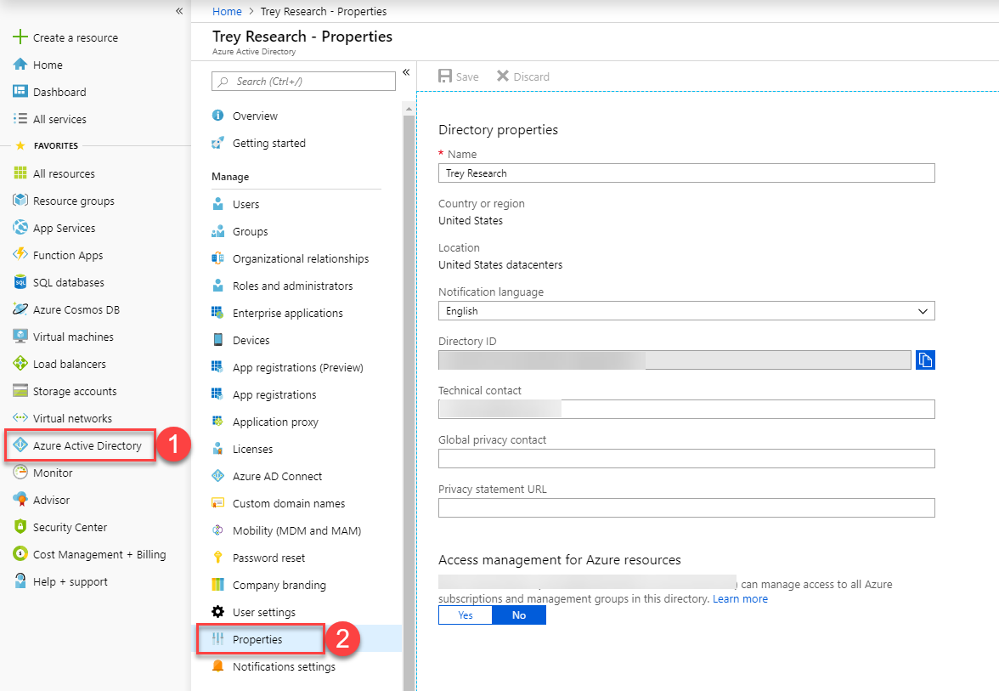
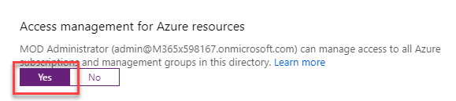
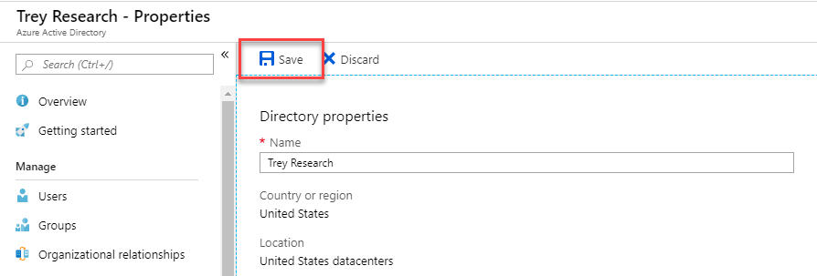

Enterprise-ready cloud

Before the hands-on lab setup guide

November 2018

Information in this document, including URL and other Internet Web site references, is subject to change without notice. Unless otherwise noted, the example companies, organizations, products, domain names, e-mail addresses, logos, people, places, and events depicted herein are fictitious, and no association with any real company, organization, product, domain name, e-mail address, logo, person, place or event is intended or should be inferred. Complying with all applicable copyright laws is the responsibility of the user. Without limiting the rights under copyright, no part of this document may be reproduced, stored in or introduced into a retrieval system, or transmitted in any form or by any means (electronic, mechanical, photocopying, recording, or otherwise), or for any purpose, without the express written permission of Microsoft Corporation.

Microsoft may have patents, patent applications, trademarks, copyrights, or other intellectual property rights covering subject matter in this document. Except as expressly provided in any written license agreement from Microsoft, the furnishing of this document does not give you any license to these patents, trademarks, copyrights, or other intellectual property.

The names of manufacturers, products, or URLs are provided for informational purposes only and Microsoft makes no representations and warranties, either expressed, implied, or statutory, regarding these manufacturers or the use of the products with any Microsoft technologies. The inclusion of a manufacturer or product does not imply endorsement of Microsoft of the manufacturer or product. Links may be provided to third party sites. Such sites are not under the control of Microsoft and Microsoft is not responsible for the contents of any linked site or any link contained in a linked site, or any changes or updates to such sites. Microsoft is not responsible for webcasting or any other form of transmission received from any linked site. Microsoft is providing these links to you only as a convenience, and the inclusion of any link does not imply endorsement of Microsoft of the site or the products contained therein.

© 2018 Microsoft Corporation. All rights reserved.

Microsoft and the trademarks listed at <https://www.microsoft.com/en-us/legal/intellectualproperty/Trademarks/Usage/General.aspx> are trademarks of the Microsoft group of companies. All other trademarks are property of their respective owners.

**Contents**

<!-- TOC -->

- [Enterprise-ready cloud before the hands-on lab setup guide](#enterprise-ready-cloud-before-the-hands-on-lab-setup-guide)
  - [Requirements](#requirements)
  - [Before the hands-on lab](#before-the-hands-on-lab)
    - [Task 1: Validate global admin access to Azure AD tenant](#task-1-validate-global-admin-access-to-azure-ad-tenant)

<!-- /TOC -->

# Enterprise-ready cloud before the hands-on lab setup guide 

## Requirements

- Full global admin access to the Azure AD tenant associated with your Azure subscription.

> **Note**: In this lab, [Azure Cloud Shell](https://docs.microsoft.com/azure/cloud-shell/overview) is used for executing commands using the Azure CLI and Azure PowerShell. Both the Azure CLI and Azure PowerShell can be installed locally if needed. 

## Before the hands-on lab

Duration: 15 minutes

To complete this lab, you must have full global admin access to the Azure AD tenant associated with your Azure subscription.

### Task 1: Validate global admin access to Azure AD tenant

To validate that you have Global Administrator access to your Azure AD tenant, we will elevate access for a Global Administrator to allow for the management of Azure resources. 

1. Sign in to the [Azure portal](https://portal.azure.com/) or the [Azure Active Directory admin center](https://aad.portal.azure.com/) as a Global Administrator.

2. In the navigation list, click **Azure Active Directory** and then click **Properties**.

    

3. Under *Access management for Azure resources*, set the toggle to **Yes**.

    

    > **Note**: When you set the toggle to Yes, you are assigned the User Access Administrator role in Azure RBAC at the root scope (/). This grants you permission to assign roles in all Azure subscriptions and management groups associated with this Azure AD directory. This toggle is only available to users who are assigned the Global Administrator role in Azure AD.

4. Click **Save** to save your setting.

    

    > **Note**: This setting is not a global property and applies only to the currently signed in user. You can't elevate access for all members of the Global Administrator role.

5.  Login to <http://portal.azure.com>, click on **All Services**, and type in **Azure Active Directory**.

6. Sign out and sign back in to refresh your access.

You should follow all steps provided *before* performing the Hands-on lab.