<div class="MCWHeader1">
Enterprise-ready cloud
</div>

<div class="MCWHeader2">
Hands-on lab step-on-step
</div>

<div class="MCWHeader3">
November 2018
</div>

Information in this document, including URL and other Internet Web site references, is subject to change without notice. Unless otherwise noted, the example companies, organizations, products, domain names, e-mail addresses, logos, people, places, and events depicted herein are fictitious, and no association with any real company, organization, product, domain name, e-mail address, logo, person, place or event is intended or should be inferred. Complying with all applicable copyright laws is the responsibility of the user. Without limiting the rights under copyright, no part of this document may be reproduced, stored in or introduced into a retrieval system, or transmitted in any form or by any means (electronic, mechanical, photocopying, recording, or otherwise), or for any purpose, without the express written permission of Microsoft Corporation.

Microsoft may have patents, patent applications, trademarks, copyrights, or other intellectual property rights covering subject matter in this document. Except as expressly provided in any written license agreement from Microsoft, the furnishing of this document does not give you any license to these patents, trademarks, copyrights, or other intellectual property.

The names of manufacturers, products, or URLs are provided for informational purposes only and Microsoft makes no representations and warranties, either expressed, implied, or statutory, regarding these manufacturers or the use of the products with any Microsoft technologies. The inclusion of a manufacturer or product does not imply endorsement of Microsoft of the manufacturer or product. Links may be provided to third party sites. Such sites are not under the control of Microsoft and Microsoft is not responsible for the contents of any linked site or any link contained in a linked site, or any changes or updates to such sites. Microsoft is not responsible for webcasting or any other form of transmission received from any linked site. Microsoft is providing these links to you only as a convenience, and the inclusion of any link does not imply endorsement of Microsoft of the site or the products contained therein.

© 2018 Microsoft Corporation. All rights reserved.

Microsoft and the trademarks listed at <https://www.microsoft.com/en-us/legal/intellectualproperty/Trademarks/Usage/General.aspx> are trademarks of the Microsoft group of companies. All other trademarks are property of their respective owners

**Contents** 

<!-- TOC -->

- [Enterprise-ready cloud hands-on lab step-by-step](#enterprise-ready-cloud-hands-on-lab-step-by-step)
  - [Abstract and learning objectives](#abstract-and-learning-objectives)
  - [Overview](#overview)
  - [Requirements](#requirements)
  - [Solution architecture](#solution-architecture)
  - [Exercise 1: Create the policy for Enterprise IT](#exercise-1-create-the-policy-for-enterprise-it)
    - [Help references](#help-references)
    - [Task 1: Create a Management Group](#task-1-create-a-management-group)
    - [Task 2: Apply the service catalog policy](#task-2-apply-the-service-catalog-policy)
    - [Task 3: Restrict the creation of ExpressRoute circuits](#task-3-restrict-the-creation-of-expressroute-circuits)
    - [Task 4: Restrict the creation of resources in regions](#task-4-restrict-the-creation-of-resources-in-regions)
    - [Task 5: Create and apply a naming convention](#task-5-create-and-apply-a-naming-convention)
    - [Task 6: Test the policies](#task-6-test-the-policies)
  - [Exercise 2: Configure delegated permissions](#exercise-2-configure-delegated-permissions)
    - [Help references](#help-references-1)
    - [Task 1: Create groups in Azure AD for delegation](#task-1-create-groups-in-azure-ad-for-delegation)
    - [Task 2: Create user accounts in Azure AD for delegation](#task-2-create-user-accounts-in-azure-ad-for-delegation)
    - [Task 3: Enable a business unit administrator for the subscription](#task-3-enable-a-business-unit-administrator-for-the-subscription)
    - [Task 4: Enable project-based delegation and chargeback](#task-4-enable-project-based-delegation-and-chargeback)
  - [Exercise 3: Create the environment for the E-commerce team](#exercise-3-create-the-environment-for-the-e-commerce-team)
    - [Help references](#help-references-2)
    - [Task 1: Create a new virtual network](#task-1-create-a-new-virtual-network)
    - [Task 2: Configure secure VPN for connectivity](#task-2-configure-secure-vpn-for-connectivity)
    - [Task 3: Create an Azure DevTest lab environment](#task-3-create-an-azure-devtest-lab-environment)
    - [Task 4: Test access to the DevTest labs environment](#task-4-test-access-to-the-devtest-labs-environment)
    - [Task 5: Finish configuring secure connectivity](#task-5-finish-configuring-secure-connectivity)
  - [After the hands-on lab](#after-the-hands-on-lab)
    - [Task 1: Remove resources and configuration created during this lab](#task-1-remove-resources-and-configuration-created-during-this-lab)

<!-- /TOC -->

# Enterprise-ready cloud hands-on lab step-by-step

## Abstract and learning objectives 

In this hands-on lab, you are working with Trey Research to setup some best practices regarding policies, permissions, and managing their Azure subscriptions using advanced tooling such as Azure Blueprints. Tasks include creating scripts that Enterprise IT will use to automatically set policy and delegate permissions when a new subscription is created. You will also learn how to manage these policies and permissions for multiple subscriptions using Azure Management Groups and Azure Blueprints.

At the end of this hands-on lab, you will know how to provide cost tracking by business unit, environment and project, provide for a distributed administration model, put a service catalog in place to prevent deployment of unsupported Azure services, and put controls in place to allow deployment of services only in specific regions.

## Overview

Trey Research is a manufacturing company that builds consumer products with 29.6 billion USD in annual revenue. Trey's headquarters are in New Jersey, but they have data centers and branch offices scattered across the United States; with several major offices in the United Kingdom, France, and Japan.

Even as large as it is, Trey seeks to maximize the cost-effectiveness and flexibility of its IT, especially in new projects and business units. With a dizzying number of existing business units; each with their own unique requirements from IT and ballooning costs from internal hardware and data center investment, Trey is looking to the cloud.

Trey is interested in a large-scale solution that will help mitigate creeping costs and start the transition to a modern cloud-based enterprise architecture using a solid set of controls for governance.

## Requirements

1. Full global admin access to the Azure AD tenant associated with your Azure subscription.

## Solution architecture


## Exercise 1: Create the policy for Enterprise IT 

Duration: 60 minutes

In this exercise, you will first create a Management Group for your Azure subscription(s). You will apply several of the built-in Azure Policy definitions to that Management Group to ensure that users stay within the scope of supported services for Enterprise IT. Finally, you will create a new policy initiative defining a multi-resource naming convention and apply that initiative to the Management Group.

### Help references

|    |            |
|----------|:-------------:|
| Azure Policy  | <https://docs.microsoft.com/azure/azure-policy/azure-policy-introduction>|
| Azure Management Groups | <https://docs.microsoft.com/azure/azure-resource-manager/management-groups-overview>|

### Task 1: Create a Management Group

In this task, you will create a new Management Group and move a subscription into this Management Group. We'll later assign Azure Policy using the Management Group scope, so that it applies automatically to all subscriptions under that scope.

> **Note**: We'll use our own Management Group, if you have permissions you could also use the Tenant Root Management Group.

1. Launch the Azure Management Portal, and navigate to **Management Groups** under **All services**:

    

2. Select **Start using management groups** to launch the **Add management group** blade.

    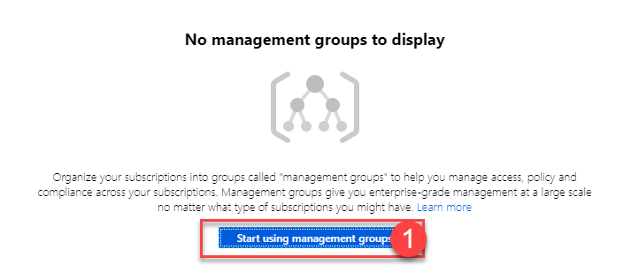

    or if you already have management groups in place, you can use the **Add management group** button to launch the **Add management group** blade.

    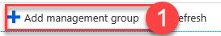

3. In the **Add management group** blade  fill in the management group ID and display name (we'll use 'ERC' as the management group ID and 'Enterprise Ready Cloud' as the display name). If you have existing management groups, create this as a child of Root and select **Save**.

    

    > **Note**: If this is the first management group being created, note that it may take up to 15 minutes for it to complete.

    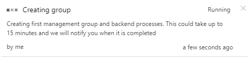

4. Select the newly-created management group, then select **details**.
    
    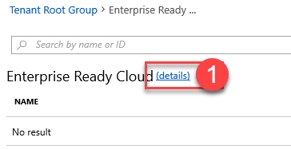

    Select **Add Subscription** and for the subscription, choose your subscription from the drop-down list, then select **Save**.

    

### Task 2: Apply the service catalog policy

In this exercise, you will apply one of the built-in Azure Policies to restrict services to the supported list provided by Trey Research.

1. First, we need to build a list of resource types, which will be permitted, and their corresponding resource providers. One way to do this is to use PowerShell. Launch the Azure Cloud Shell and select PowerShell. If prompted to create storage, click the **Create storage** button.

    

    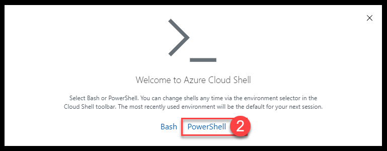

2. Enter the following script into the window and run the script:

    ```powershell
    $FormatEnumerationLimit = -1
    Get-AzResourceProvider `
        | Select-Object ProviderNamespace, ResourceTypes `
        | Format-List
    ```

3. Review the list, and identify the resource providers and resource types for each of the following:

    ```s
    Resource Name
    --------------------------
    - Resource Group
    - Virtual Machines
    - Disk
    - Network Interface
    - Public IP Address
    - Network Security Group
    - Virtual Networks
    - Virtual Network Gateways
    - ExpressRoute Circuits
    - VPN Gateways
    - Storage Accounts
    - Backup Vault
    - Site Recovery Vault
    - DevTest Labs
    - Key Vault
    - Web Apps
    - SQL Database
    ```

    For example, to find all of the resource providers with resource groups as a resource type, a query like the following could be used:

    ```powershell
    Get-AzResourceProvider `
        | Select-Object ProviderNamespace, ResourceTypes `
        | Where-Object { $_.ResourceTypes.ResourceTypeName -like "*resource*groups*" } `
        | Format-List
    ```

    This query shows that the `resourceGroups` resource type is a member of the resource provider `Microsoft.Resources`.

    By altering the `-like` clause, you can filter to easily find the resource providers for the remaining resource types.

    > **Note:** If you do not see the Microsoft.Compute resource provider it is because you have not yet created any compute resources. You can manually register the provider with the following command:

    ```powershell
    Register-AzureRmResourceProvider -ProviderNamespace Microsoft.Compute
    ```

4. Launch the Azure Management portal, and navigate to **Policy** under **All services**:

    

    > **Hint**: Click the star next to the Policy service to pin it to your Portal navigation. You will visit the Policy service throughout the lab.

5. Select **Definitions**, then **+ Policy definition**. 

    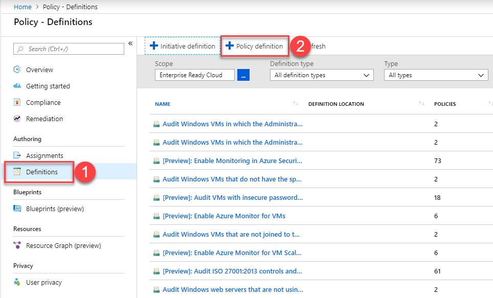 

6.  In the Policy definition blade, use the following configurations:

    - Definition location: **Enterprise Ready Cloud** (ERC) management group, as created in Task 1
    - Name: **Service catalog**
    - Description: **Restrict resource types to those permitted by Enterprise IT**
    - Category: **Create new** > **Service catalog**
    - Policy rule: ***Replace the default JSON with the following code:***

    ```json
    {
        "policyRule": {
            "if": {
                "not": {
                    "anyOf": [
                        {
                        "source": "action",
                        "like": "Microsoft.Resources/*"
                        },
                        {
                        "source": "action",
                        "like": "Microsoft.Compute/virtualMachines/*"
                        },
                        {
                        "source": "action",
                        "like": "Microsoft.Compute/virtualMachines/extensions/*"
                        },
                        {
                        "source": "action",
                        "like": "Microsoft.Compute/virtualMachines/locations/*"
                        },
                        {
                        "source": "action",
                        "like": "Microsoft.Compute/virtualMachines/disks/*"
                        },
                        {
                        "source": "action",
                        "like": "Microsoft.Compute/disks/*"
                        },
                        {
                        "source": "action",
                        "like": "Microsoft.Compute/virtualMachines/diagnosticSettings/*"
                        },
                        {
                        "source": "action",
                        "like": "Microsoft.Compute/virtualMachines/metricDefinitions/*"
                        },
                        {
                        "source": "action",
                        "like": "Microsoft.Compute/virtualMachines/images/*"
                        },
                        {
                        "source": "action",
                        "like": "Microsoft.Compute/availabilitySets/*"
                        },
                        {
                        "source": "action",
                        "like": "Microsoft.Network/loadBalancers/*"
                        },
                        {
                        "source": "action",
                        "like": "Microsoft.Network/virtualNetworks/*"
                        },
                        {
                        "source": "action",
                        "like": "Microsoft.Network/networkSecurityGroups/*"
                        },
                        {
                        "source": "action",
                        "like": "Microsoft.Network/publicIPAddresses/*"
                        },
                        {
                        "source": "action",
                        "like": "Microsoft.Network/networkInterfaces/*"
                        },
                        {
                        "source": "action",
                        "like": "Microsoft.Network/operations/*"
                        },
                        {
                        "source": "action",
                        "like": "Microsoft.Network/locations/*"
                        },
                        {
                        "source": "action",
                        "like": "Microsoft.Network/expressRouteCircuits/*"
                        },
                        {
                        "source": "action",
                        "like": "Microsoft.Network/virtualNetworkGateways/*"
                        },
                        {
                        "source": "action",
                        "like": "Microsoft.Network/vpnGateways/*"
                        },
                        {
                        "source": "action",
                        "like": "Microsoft.Network/p2sVpnGateways/*"
                        },
                        {
                        "source": "action",
                        "like": "Microsoft.Storage/*"
                        },
                        {
                        "source": "action",
                        "like": "Microsoft.RecoveryServices/*"
                        },
                        {
                        "source": "action",
                        "like": "Microsoft.DevTestLab/*"
                        },
                        {
                        "source": "action",
                        "like": "Microsoft.KeyVault/*"
                        },
                        {
                        "source": "action",
                        "like": "Microsoft.Web/*"
                        },
                        {
                        "source": "action",
                        "like": "Microsoft.SQL/*"
                        },        
                        {
                        "source": "action",
                        "like": "Microsoft.Authorization/*"
                        },
                        {
                        "source": "action",
                        "like": "Microsoft.Insights/*"
                        }
                    ]
                }
            },
            "then" : {
                "effect" : "deny"
            }
        }
    }
    ```

1. Click **Save**.

7. On the ***Policy \- Definitions*** blade, select the **Service catalog** policy definition you just created and then select **Assign** on the *Service catalog* blade.

    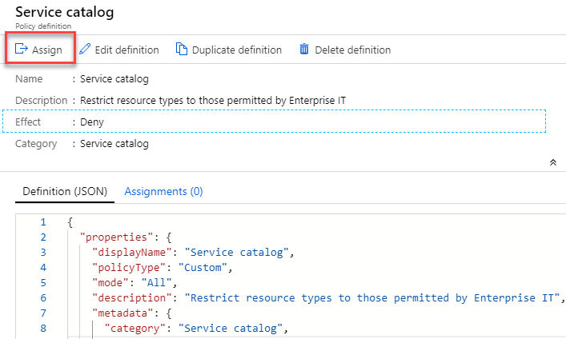

    > **Note**: If you do not see the policy, make sure "Enterprise Ready Cloud" is the selected scope, and not another Management group or an individual subscription.

8. On the ***Service catalog \- Assign policy blade***, specify the following configurations and then click **Assign** to assign your policy definition to your Enterprise Ready Cloud management group:

    - Scope: **Enterprise Ready Cloud**
    - Exclusions: **None**
    - Policy definition: **Service catalog**
    - Assignment name: **Service catalog policy**
    - Description: **Restrict resource types to those permitted by Enterprise IT**
    - Assigned by: **Enterprise IT**

    The assignment form should look like this:

    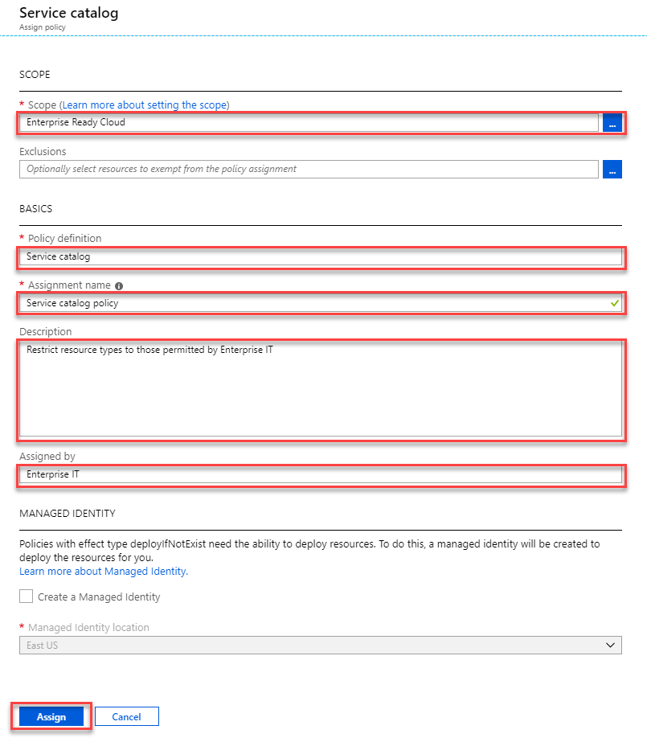

### Task 3: Restrict the creation of ExpressRoute circuits

In this exercise, you will apply another built-in Azure policy to restrict the creation of ExpressRoute circuits. For this policy, we'll use an exclusion scope for the resource group in which Enterprise IT will create the permitted ExpressRoute circuits.

1. First, we'll create the resource group for the exclusion scope. Select **Resource groups**, then **Add**, and then fill in the resource group name **ExpressRouteRG**, select your subscription, and choose a resource group location:

    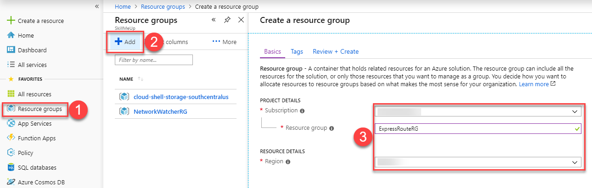

1. Once complete, select **Review + Create** and then **Create**.

2. Return to the **Policy** blade in the Azure portal. Select **Assignments**, then **Assign Policy**. Complete the form as follows:

    - Scope: **Enterprise Ready Cloud** (the management group created earlier)
    - Exclusions: **The resource group created in Step 1 above. Select the management group, subscription, and resource group**.    
    - Policy definition: **Not allowed resource types**
    - Assignment name: **Block ExpressRoute circuits**
    - Description: **Block creating of ExpressRoute circuits, except in the Enterprise IT dedicated ExpressRoute resource group**
    - Assigned by: **Enterprise IT**
    - Parameters \| Not allowed resource types: **Microsoft.Network/expressRouteCircuits**

    The assignment form should look like this:

    

3. When complete, select **Assign** to create the policy assignment.

### Task 4: Restrict the creation of resources in regions 

In this exercise, you will create a new Azure Policy assignment that restricts the regions in which resources can be created in.

1. In the Azure portal, navigate to **Policy**, then select **Assignments**, then **Assign Policy**. Complete the form as follows:

    - Scope: **Enterprise Ready Cloud**
    - Exclusions: **None**
    - Policy definition: **Allowed locations**
    - Assignment name: **Restrict Azure locations**
    - Description: **Restrict Azure resources to the list of Azure regions permitted by Enterprise IT**.
    - Assigned by: **Enterprise IT**
    - Parameters \| Allowed locations: **East US, West US, North Europe, West Europe, Japan East, Japan West**

    The assignment form should look like this:

    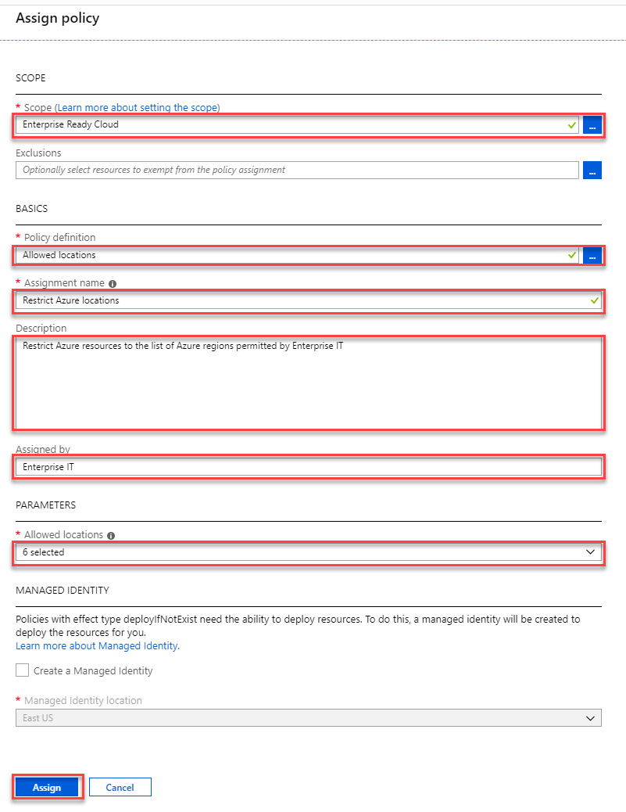

2. When complete, select **Assign** to create the policy assignment.

### Task 5: Create and apply a naming convention

In this task, we will define a simple naming convention for Azure resources. We shall simply require that virtual machine names end with ***-vm*** and virtual networks end with ***-vnet***. We will implement this naming convention using a custom policy definition and a policy initiative, assigned at the management group scope.

First, we will create a generic policy definition that restricts resources of a given type to have a given name suffix. The resource type and name suffix will be specified using parameters.

1. In the Azure portal, open the **Policy** blade, then select **Definitions** and then **+ Policy definition**.

    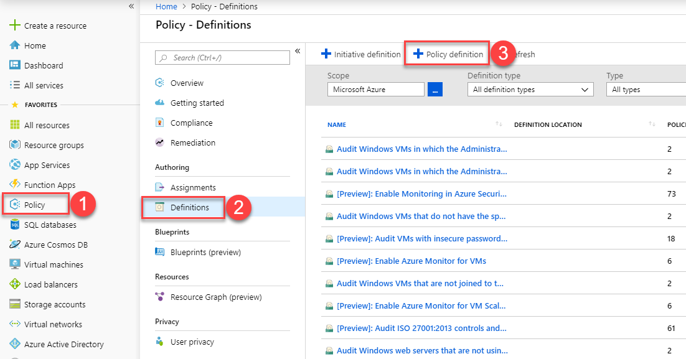

2. Complete the Policy definition form as follows:

    - Definition location: **Enterprise Ready Cloud** (the Management Group created earlier)
    - Name: **Restrict Resource Name Suffix**
    - Description: **Restrict resources of a given type to have a name ending with a given suffix. The resource type and suffix are parameterized.**
    - Category:  **Create new** > **Naming"**
    - Policy rule and parameters: **As shown below:**

    ```json
    {
        "properties": {
            "mode": "all",
            "parameters": {
                "resourceType": {
                    "type": "string",
                    "metadata": {
                        "displayName": "Resource Type",
                        "description": "The resource type for this policy",
                        "strongType": "resourceTypes"
                    }
                },
                "nameSuffix": {
                    "type": "string",
                    "metadata": {
                        "displayName": "Resource Name Suffix",
                        "description": "The suffix that must be appended"
                    }
                }
            },
            "policyRule": {
                "if": {
                    "allof": [
                    {
                        "field": "type",
                        "equals": "[parameters('resourceType')]"
                    },
                    {
                        "not": {
                        "field": "name",
                        "like": "[concat('*-', parameters('nameSuffix'))]"
                        }
                    }
                    ]
                },
                "then": {
                    "effect": "deny"
                }
            }
        }
    }
    ```

1. Once the policy definition is complete, select **Save**.

3. Next, we shall create a policy initiative comprising multiple instances of our policy definition (one per resource type).

    From the **Policy** blade, on the **Definitions** panel, select **+ Initiative Definition**.

4. Fill in the **Initiative definition** blade as follows (but **do not** select **Save** yet).

    - Definition location: **Enterprise Ready Cloud** (the Management Group created earlier)
    - Name: **Naming Convention**
    - Description: **Trey Research resource naming convention**
    - Category: **Use Existing** > **Naming**

    

5. Under ***Available Definitions***, find the *Restrict Resource Name Suffix* policy definition created in Step 2.

    

6. Select the policy definition, then select **+Add** to add the Policy Definition to the Policy Initiative.

    

7. Select the resource type and name suffix. In this case, we'll choose **Microsoft.Compute/virtualMachines** as the resource type and **vm** as the name suffix. **Do not click Save**.

    

8. Repeat steps 5, 6, and 7 above for each of the following resource types:

    - Virtual Networks
        - Resource Type: **Microsoft.Network/virtualNetworks**
        - Resource Name Suffix: **vnet** 

9. Once you've added each resource type, select **Save**.

10. Finally, we will apply the policy initiative across all subscriptions in the Management Group by creating an assignment at the Management group scope.

    On the **Policy** blade, select **Assignments** and then **Assign Initiative**.

    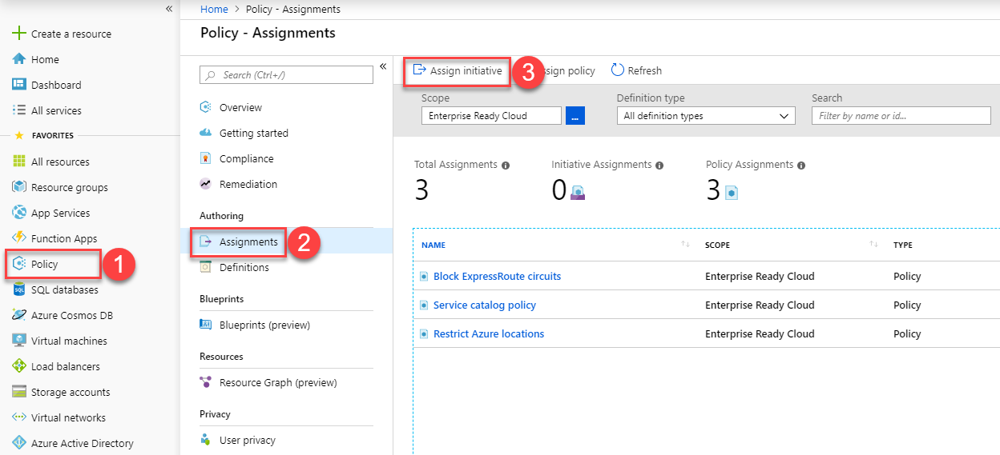

11. Complete the Assign Initiative form as follows:

    - Scope: **Enterprise Ready Cloud** (the Management Group created earlier)
    - Exclusions: **None**
    - Initiative definition: **Naming Convention** (the initiative definition we just created).
    - Assignment name: **Resource Naming Convention**
    - Description: **Enforces company-wide resource naming convention**
    - Assigned by: **Enterprise IT**

    The assignment form should look like this:

    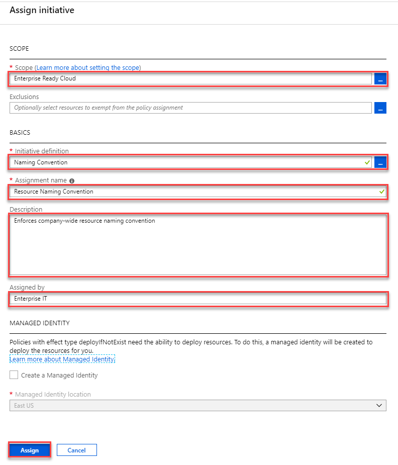

12. When complete, select **Assign** to create the policy initiative assignment.

### Task 6: Test the policies 

In this task, you will use the Azure management portal to validate each of the policies created so far, and understand how to identify policy events.

#### Subtask 1: Test the service catalog policy <!-- omit in toc -->

1. Select **Create a Resource \> Internet of Things \> IoT Hub**.

    

2. Specify a unique name for the IoT Hub, and choose an existing resource group. Choose a permitted location (we are only testing the Service Catalog policy at this time).

    Once all the settings have been filled in, select **Review + create** followed by **Create**.

    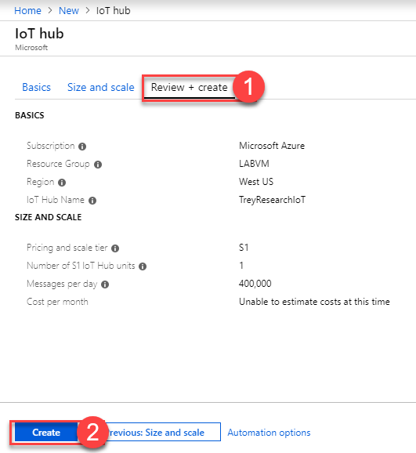

3. The IoT Hub creation blade should show an error:

    

#### Subtask 2: Test the ExpressRoute circuit policy <!-- omit in toc -->

1. Select **Create a resource** **\>** **Networking** **\>** **ExpressRoute**.

    

2. Specify the following configuration for the circuit and select **Create**.

    - Create new or import from classic: **Create new**
    - Circuit name: **TestCircuit**
    - Provider: **AT&T**
    - Peering location: **Silicon Valley**
    - Bandwidth: **50Mbps**
    - SKU: **Standard**
    - Billing model: **Unlimited**
    - Subscription: **Select your Azure subscription**
    - Resource group: **Any resource groupe *except* ExpressRouteRG OR Create new**
    - Location: **Any available location in the allowed locations policy**

     

3. As with the Service Catalog policy, you should see an error in the Create ExpressRoute Circuit blade, which when clicked shows the error details:

    

    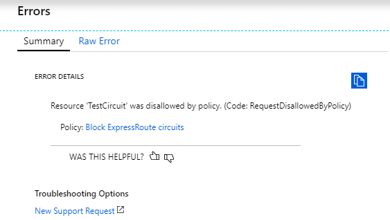

    > **Note**: If you created a new resource group in the previous step, you will see that the resource group has been created even though the deployment of the resource failed. This is because the policy that was created to restrict the creation of ExpressRoute circuits specifically targets that Azure resource type and a resource group is another distinct resource type.

#### SubTask 3: Test the resource location policy <!-- omit in toc -->

1. Testing the resource location policy follows a similar pattern. Attempt to create a permitted resource, with a permitted name, but in a not-permitted region. For example, attempt to create a virtual network named 'erc-vnet' in South Central US. This should be rejected by the 'Restrict Azure locations' policy.

    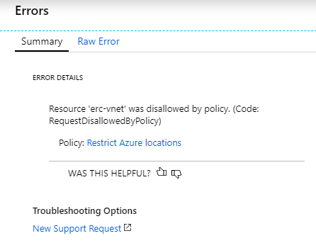

2. To test further, change to a permitted location (e.g. East US) and try again. This time, the virtual network should be created without issue.

    > **Note**: Recall that an initiative assignment was made earlier to deny the creation of resources that do not meet the organizational naming conventions. If you had attempted to create a virtual networking without `-vnet` in its name, the creation of the resource would have been denied by the initiative assignment and its associated configuration.

#### SubTask 4: Test the naming convention policy <!-- omit in toc -->

1. Attempt to create a permitted resource, in a permitted location, with a not-permitted name. For example, create a virtual network named 'erc-network' in East US. This should be rejected by the 'Resource Naming Convention' policy.

2. To test further, change to a permitted name (e.g. 'erc-network-vnet') and try again---this time, the virtual network should be created without issue.

## Exercise 2: Configure delegated permissions

Duration: 60 minutes

In this exercise, you will configure delegated permissions for users in the Trey Research business unit. You will extend a PowerShell script to automatically provision a limited access user with the configuration of the subscription.

### Help references

|    |            |
|----------|:-------------:|
| Add new users to Active Directory | <https://docs.microsoft.com/azure/active-directory/add-users-azure-active-directory> |
| How Subscriptions are associated with Azure AD | <https://docs.microsoft.com/azure/active-directory/active-directory-how-subscriptions-associated-directory> |
| Managing Azure AD Security Groups | <https://docs.microsoft.com/azure/active-directory/active-directory-groups-create-azure-portal> |
| Role Based Access Control  | <https://docs.microsoft.com/azure/active-directory/role-based-access-control-configure> |
| Manage RBAC with PowerShell | <https://docs.microsoft.com/azure/active-directory/role-based-access-control-manage-access-powershell> |

### Task 1: Create groups in Azure AD for delegation 

In this task, you will create two groups in Azure AD that you will use for testing delegated access control. In the next task, users will be created that will be added to these existing security groups.

1. Open the Azure Active Directory blade in the Azure portal in your browser. 
   
   ```s
   https://portal.azure.com
   ```

2. Select **Groups**, and then select **New group**.

    

3. Specify the **Security** as the Group type and **BU-Electronics-Admin** as the **Name** and **Description**. Change the Membership type to **Assigned**. Click **Create**.

    

4.  Repeat the process, and create another group named **BU-Electronics-Users**.

### Task 2: Create user accounts in Azure AD for delegation 

In this task, you will create two user accounts in Azure AD that you will use for testing delegated access control.

1. Navigate to **All services -\> Azure Active Directory**, and select **Custom domain names** to find out the name of your Azure AD tenant (this will be needed in the next step).

    

2.  Select **Users**, and then select **+New user**.

    

3.  Specify the following configuration for the new user:

    - Name:  **Electronics Admin**
    - User name:  **[ElectronicsAdmin@\[yourtenant\].onmicrosoft.com](mailto:ElectronicsAdmin@[yourtenant].onmicrosoft.com)**
    - Groups: **Add the user to the BU-Electronics-Admin group**.
    - Password: **Check the Show password checkbox and note the password for later**.

     |


4.  Create a second user with the following configuration:

    - Name: **Electronics User** 
    - User name: **[ElectronicsUser@\[yourtenant\].onmicrosoft.com](mailto:ElectronicsUser@[yourtenant].onmicrosoft.com)**
    - Groups: **Add the user to the BU-Electronics-User group**.
    - Password: **Check the Show password checkbox and note the password for later**.
                                                
     |

### Task 3: Enable a business unit administrator for the subscription 

In this task, you will update a script to automatically add a user to the contributor role of the subscription.

1.  Launch the Azure Cloud Shell and select PowerShell. If prompted to create storage, click the **Create storage** button.

    

    

2.  Create a new script the Cloud Shell using **code** by typing the following:

    ```powershell
    code 
    ```

3.  Add the following code to script, and save the file. This code will retrieve the object ID for the Active Directory group passed in and assign the group to the Contributor role on the subscription.

    ```powershell
    param([string]$SubscriptionId, [string]$AdGroupName) 

    Select-AzureRmSubscription -SubscriptionId $SubscriptionId

    $scope = "/subscriptions/$SubscriptionId"

    $groupObjectId = (Get-AzureRmADGroup -SearchString $AdGroupName).Id.Guid

    Write-Output "Adding group to contributor role"

    New-AzureRmRoleAssignment -Scope $scope `
                            -RoleDefinitionName "Contributor" `
                            -ObjectId $groupObjectId 
    ```

    This code will add an Azure AD security group to the contributor role at the subscription scope.

1. Save the file as **ConfigureSubscription.ps1**.

4.  Create a local variable containing your Subscription ID (you can copy your subscription ID from the Azure portal, or obtain it using Get-AzureRmSubscription):

    Paste this under the param section of the script and save.

    ```powershell
    $SubscriptionId = "{your subscription id}"
    ```

5.  Execute the script passing in the *-SubscriptionID* and *-AdGroupName* parameters:

    ```powershell
    . $HOME\ConfigureSubscription.ps1 -SubscriptionId $SubscriptionId -AdGroupName "BU-Electronics-Admin"
    ```

6.  Close all instances of your browser (or switch to a different type of browser) and re-launch In-Private or Incognito mode.

7.  Navigate to the Azure management portal in a browser <http://portal.azure.com>, and sign in using the **ElectronicsAdmin** credentials created earlier. When prompted to change your password, specify a strong password you will remember.

    You may be prompted to configure a method of resetting your account. If you are, you can choose either a phone call or email.

8.  Select **All services**, and then select **Subscriptions**.

    

9.  Select the name of the subscription you have been working on.

10. Select the **Access control (IAM)** tile and click the **Role assignments** tab:

    

11. You should see the BU-Electronics-Admin group assigned to the contributor role.

    

    Users in the contributor role scoped at the subscription have full access to all the resources within the subscription, but cannot grant access to others or change policies on the subscription.

### Task 4: Enable project-based delegation and chargeback

In this task, you will create a script that will create a new resource group, assign 'Owner' rights over the resource group to a given AD group, and then apply a policy to enforce an 'IOCode' and 'CostCenter' tag with a given value.

1.  Login to the Azure portal using your normal credentials (not the ElectronicsAdmin account). 

2.  Launch the Azure Cloud Shell and select PowerShell. If prompted to create storage, click the **Create storage** button.

    

    

3.  Create a new script called **CreateProjectResourceGroup.ps1** and open in the Cloud Shell using **code** by typing the following:

    ```powershell
    touch CreateProjectResourceGroup.ps1; code CreateProjectResourceGroup.ps1
    ```

4.  Add the following code to the script, and **Save** the file:

    ```powershell
    param(
        [string]$SubscriptionId, 
        [string]$ResourceGroupName, 
        [String]$Location, 
        [String]$IOCode,
        [String]$CostCenter,
        [string]$AdGroupName
    ) 

    Select-AzureRmSubscription -SubscriptionId $SubscriptionId

    # Create resource group
    New-AzureRmResourceGroup -Name $ResourceGroupName -Location $Location 

    $scope = "/subscriptions/$subscriptionId/resourceGroups/$resourceGroupName"

    # Assign Owner role to given group
    $groupObjectId = (Get-AzureRmADGroup -SearchString $AdGroupName).Id.Guid

    New-AzureRmRoleAssignment -Scope $scope `
                            -RoleDefinitionName "Owner" `
                            -ObjectId $groupObjectId

    # Assign policy to apply IOCode tag
    $definition = Get-AzureRmPolicyDefinition | where {$_.Properties.displayName -eq "Apply tag and its default value"}

    $parameters = @{
        tagName = 'IOCode'
        tagValue = $IOCode
        }

    New-AzureRmPolicyAssignment -Name "AppendIOCode" `
                                -Scope $scope `
                                -DisplayName "Append IO Code" `
                                -PolicyDefinition $definition `
                                -PolicyParameterObject $parameters
    
    # Assign policy to apply CostCenter tag
    $definition = Get-AzureRmPolicyDefinition | where {$_.Properties.displayName -eq "Apply tag and its default value"}

    $parameters = @{
        tagName = 'CostCenter'
        tagValue = $CostCenter
        }

    New-AzureRmPolicyAssignment -Name "AppendCostCenter" `
                                -Scope $scope `
                                -DisplayName "Append Cost Center" `
                                -PolicyDefinition $definition `
                                -PolicyParameterObject $parameters
    ```

    This code creates a new resource group in the specified region. It then assigns the group to the owner role definition just for the resource group. It will allow users in the group to have full ownership of resources within the resource group only. This code applies a built-in policy to append a tag with name 'IOCode' and another tag for 'CostCenter' and then applies the given tag value to any resource created in the resource group.

5.  In the **Console** pane, create a new variable called **\$location**, and specify a region name to deploy to the resource group to. This location must be one of the supported regions in your previously created policy.

    ```powershell
    $location = "East US"
    ```

6.  In the **Console** pane, create a new variable called **\$resourceGroupName**, and specify the value as **DelegatedProjectDemo**. Also, make sure you create a **\$SubscriptionId** variable as you did earlier.

    ```powershell
    $resourceGroupName = "DelegatedProjectDemo"
    $SubscriptionId = "{your subscription id}"
    ```

7.  In the **Console** pane, execute the following command to create a new resource group with delegated permissions and IO Code and Cost Center policies.

    ```powershell
    . $HOME\CreateProjectResourceGroup.ps1 -SubscriptionId $SubscriptionId -ResourceGroupName $resourceGroupName -Location $location -IOCode "1000150" -CostCenter "Marketing" -AdGroupName "BU-Electronics-Admin"
    ```

8.  Create a new storage account in the resource group (choose a unique name) to validate the ioCode tag was applied (replace *uniquestorageaccount* with a unique value).

    ```powershell
    New-AzureRmStorageAccount -ResourceGroupName $resourceGroupName `
        -Name "uniquestorageaccount" `
        -SkuName Standard_LRS `
        -Location $location 
    ```

9.  You can now search for resources with the applied tags to verify the policy has been applied. Execute the following PowerShell to validate.
   
    ```powershell
    Get-AzureRmResource -TagName ioCode
    Get-AzureRmResource -TagName CostCenter
    ```
    In the output, you should see your storage account returned for each tag.

    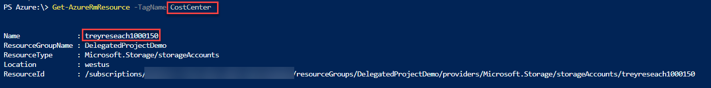

10. Switch back to the Azure Management portal using the ElectronicsAdmin credentials.

11. Select **Resource Groups**.

12. Select the **DelegatedProjectDemo** resource group.

    

13. Select the **Access control (IAM)** icon, then select the **Role assignments** tab.

    

14. Note that the BU-Electronics-Admin role is set as the owner of the resource group.

    

15. Select **Add role assignments**.

    

16. Select **Owner** for the Role.

    

17. Select the **BU-Electronics-Users group** and select **Save** to add the group to the role .

    

## Exercise 3: Create the environment for the E-commerce team

Duration: 75 minutes

In this exercise, you will configure a new environment for the developers of the e-commerce team. You will configure access to a subnet where other developer resources are available, and provide secure access to the network for the developers.

### Help references

|    |            |
|----------|:-------------:|
| Configuring Point-to-Site Secure VPN  | <https://azure.microsoft.com/en-us/documentation/articles/vpn-gateway-howto-point-to-site-rm-ps/>|
| Network Security Groups | <https://azure.microsoft.com/en-us/documentation/articles/virtual-networks-nsg/> |
| Azure DevTest Labs    | <https://azure.microsoft.com/en-us/documentation/services/devtest-lab/> |
| MakeCert.exe |  <https://cloudworkshop.blob.core.windows.net/enterprise-ready-cloud/makecert.exe> |

### Task 1: Create a new virtual network

In this task, you will create a new virtual network for Trey Research.

1.  Sign in to the Azure Management portal using the subscription owner user account.

2.  Select **Create a resource** **\> Networking \>** **Virtual Network**.

    

3.  Specify the following configuration for the virtual network:

    - Name: **TreyResearch-vnet**   
    - Address Space: **10.10.0.0/16**
    - Resource Group: **TreyResearchRG (Create New)**
    - Location: **Choose one of the supported regions**.
    - Subnet Name: **Apps**
    - Subnet Address Range: **10.10.0.0/24**
    - DDoS Protection: **Basic**
    - Service endpoints: **Disabled**
    - Firewall: **Disabled**

    

4.  Click **Create**.

5.  After the virtual network has been created, browse to it in the portal and select **Subnets**.

    

6.  Select **+Subnet**.

    

7.  Name the subnet **ECommerceDev**, and then specify the Address Range as **10.10.1.0/24** and click **OK**.

    

8.  Select **+ Gateway subnet** to add a gateway subnet to the virtual network. Note that VPN gateway and ExpressRoute gateway could be co-existing at Gateway subnet. We recommend that you create a gateway subnet of /27 or larger (/27, /26, /25 etc.).

    

9.  Select **OK** on the new blade that opens to create the Gateway subnet with the default settings.

### Task 2: Configure secure VPN for connectivity

In this task, you will start the provisioning of a VPN gateway that will be used for secure connectivity for Trey Research.

1.  Select **Create a resource** \> **Networking** **\>** **Virtual network gateway**.

    

2.  Name the VPN Gateway **DevVPN**, select the existing **TreyResearchVNET** virtual network, specify the Basic SKU, and specify a new Public IP address named **DevVPN** (again, with the Basic SKU). Note that the Basic SKU is considered a legacy SKU. The Basic SKU has certain feature limitations; it is for Dev-test or proof of concept. You can't resize a gateway that uses a Basic SKU to one of the new gateway SKUs.

    

3.  Click **Create** to start provisioning the VPN gateway.

    **>Note:** This step will take up to 45 minutes to complete. Continue to the next task. Gateway configuration will be continued in a later task.

### Task 3: Create an Azure DevTest lab environment 

In this task, you will create and configure a new development environment for Trey Research developers and contingent staff.

1.  Before we create the DevTest lab environment we need to create a resource group for it and modify our existing policies to exclude the resource group. Select **Resource groups** from the Azure portal menu, then click **+Add**.

    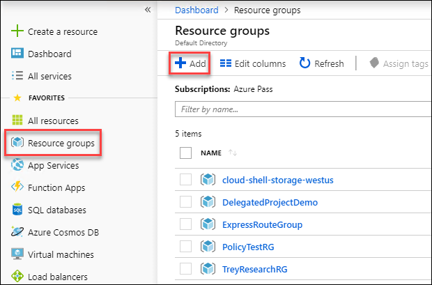

2.  Specify the following configurations, then click **Create**.

    -  Resource group name: **ERC**
    -  Subscription: ***Your subscription***
    -  Resource group location: ***The location you are using for this lab***

        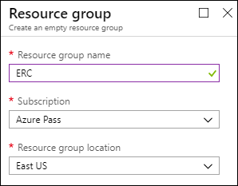

3.  Navigate to **All services** \> **Policy**, select the **Service catalog** policy.

4.  On the service catalog blade select **Edit assignment**.

    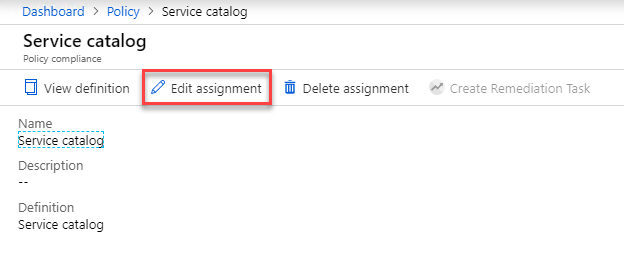

5.  Select the elipses next to **Exclusions**, select your subscription, then select the **ERC** resource group, click **Add to Selected Scope**, then click **Save** on the Exclusions blade, then click **Save** on the service catalog blade.

    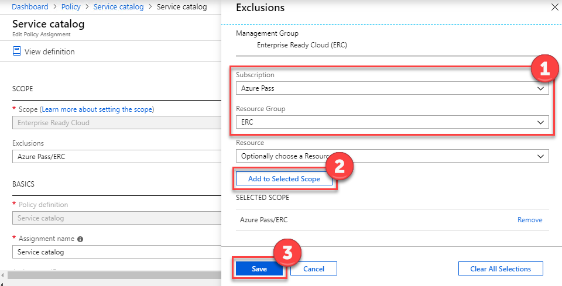

6.  Repeat steps 3-5 for the **Resource Naming Convention** initiative.

    

7.  Select **Create a resource** **\>** **Developer tools \>** **DevTest Labs**.

    

8.  Name the lab **TreyResearchDev**, use the existing **ERC** resource group, and then specify the same region you deployed the virtual network to.

    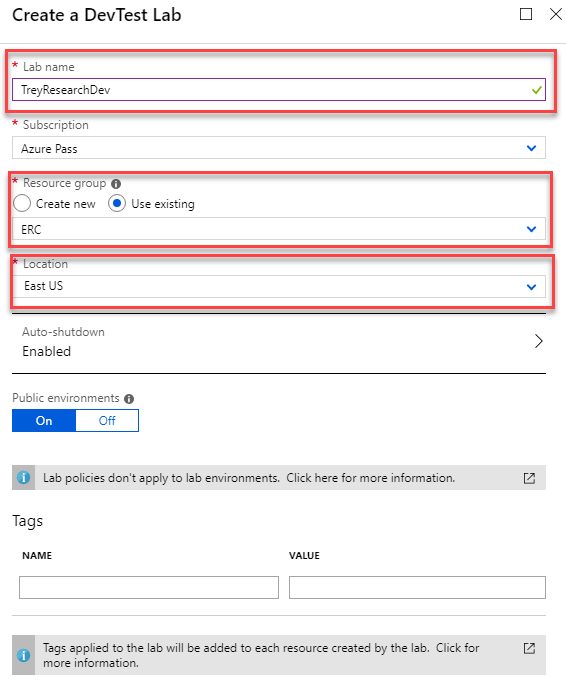

    When completed, select **Create**.

    It may take several minutes for the DevTest Lab to provision. 

9.  Open the DevTest lab environment **TreyResearchDev** after it has fully provisioned.

    

10. Open **Settings \> Configuration and policies**.

    

11. Select **Virtual Networks**.

    

    Right-click the default virtual network created for the DevTest lab environment, and then select **Remove**.

    

12. Select the **Add** button.

    

13. Select **\[Select virtual network\]**, and then select **TreyResearch-vnet**.

    

14. Configure the ECommerceDev subnet to **allow** **USE IN VIRTUAL MACHINE CREATION**, and to **disable** **ENABLE SHARED PUBLIC IP**. Then select **Save**. Wait for the blade to update to **Saved** and then close it.

    

15. Configure a virtual machine policy for this DevTest lab by clicking **Allowed virtual machine sizes**, select **Standard\_DS2\_v2 (or Standard\_DS2)**, and then select **Save**.

    

16. Enable the virtual machines per user policy. Set a maximum number of virtual machines per user to one, and then select **Save**.

    

17. Allow access to the DevTest labs users by selecting the **Access control** icon within Configuration and Policies.

    

18. Select **+Add**.

    

19. Select **Role** as **Owner**, type 'BU-Electronics-Admin into the search field, and select the **BU-Electronics-Admin** group.

    

    Then select **Save**.

    

### Task 4: Test access to the DevTest labs environment 

In this task, you will use the ElectronicsAdmin user account to grant access to the developer environment. Then you will validate as a user whether access was successfully granted.

1.  Sign in to the Azure Management Portal as the **ElectronicsAdmin** user account.

2.  Open the DevTest labs environment by selecting **All services** **\>** **DevTest Labs** **\>** **TreyResearchDev**.

3.  Select **Configuration and policies**.

    

4.  Allow access to the DevTest Labs users by selecting the **Access** **control** icon within Configuration and Policies.

    

5. Select **+Add**.

    

6.  Specify the **Role** as **DevTest Labs User**. Use the search field to find the **ElectronicsUser** account, and select it. Then select **Save**.

    

7.  Close your browser and sign in with the **ElectronicsUser** account. You will have to change your password and may need to setup a recovery mechanism with this account.

8.  Open the DevTest labs environment by selecting **All services** **\>** **DevTest Labs** **\>** **TreyResearchDev**.

9.  Select **My virtual machines**, and then select **+Add** to provision a virtual machine for the developer.

    

10. On the **Choose a Base** blade, select the **Visual Studio Community 2017 on Windows Server 2016 (x64)** image.

    

11. Specify the **virtual machine name** as well as a **user name** and **password**. Note that the VM size, IP address configuration, virtual network, and subnet are not changeable by the user.

    

12. Select **Artifacts**.

     blade")

13. Add **Azure PowerShell** to the artifacts of the VM by selecting their names and selecting **ADD**. Select **OK** at the bottom of the **Add artifacts** blade when complete.

    

14. Select **Create** to provision the virtual machine.

### Task 5: Finish configuring secure connectivity

In this task, you will configure certificates for the VPN gateway for the end users and complete configuration of the VPN gateway. You will then configure and test access to the development environment.

**Subtask 1: Create certificates for point-to-site VPN**

1.  Download makecert.exe from: <https://cloudworkshop.blob.core.windows.net/enterprise-ready-cloud/makecert.exe> and save it to the C:\\Hackathon\\ERC folder.

2.  Launch a PowerShell prompt, and navigate to the **C:\\Hackathon\\ERC** folder by typing in the following command:

    ```
    CD C:\Hackathon\ERC
    ```

3.  Execute the following command to generate a root certificate for configuring a point-to-site VPN gateway:

    ```
    .\makecert -sky exchange -r -n "CN=P2SROOT" -pe -a sha1 -len 2048 -ss My .\P2SRoot.cer
    ```
    ```powershell
    $cert = New-SelfSignedCertificate -Type Custom -KeySpec Signature `
        -Subject "CN=P2SRootCert" -KeyExportPolicy Exportable `
        -HashAlgorithm sha256 -KeyLength 2048 `
        -CertStoreLocation "Cert:\CurrentUser\My" `
        -KeyUsageProperty Sign `
        -KeyUsage CertSign
    ```

4.  Execute the following command to generate a client certificate:

    ```powershell
    New-SelfSignedCertificate -Type Custom -DnsName P2SChildCert `
        -KeySpec Signature `
        -Subject "CN=P2SChildCert" -KeyExportPolicy Exportable `
        -HashAlgorithm sha256 -KeyLength 2048 `
        -CertStoreLocation "Cert:\CurrentUser\My" `
        -Signer $cert `
        -TextExtension @("2.5.29.37={text}1.3.6.1.5.5.7.3.2")
    ```

5.  To obtain a .cer file from the certificate, open **Manage user certificates**. Locate the self-signed root certificate, typically in 'Certificates - Current User\Personal\Certificates', and right-click. Click **All Tasks**, and then click **Export**. This opens the **Certificate Export Wizard**.

    

1. In the Wizard, click **Next**.

1. Select **No, do not export the private key**, and then click **Next**.

2.  Change the encoding type to **Base-64 encoded X.509 (.CER)**, and then select **Next**.

    

3.  Specify the filename as **C:\\Hackathon\\ERC\\PublicKeyFile**. Select **Next** and then **Finish**.

    

4.  Open the newly created PublicKeyFile in Notepad, and copy the certificate text to the clipboard. Do NOT copy the first and last lines containing \-\-\-\--BEGIN CERTIFICATE\-\-\-\-- and \-\-\-\--END CERTIFICATE\-\-\-\--.

**Subtask 2: Configure the VPN gateway**

1.  In the Azure Portal, make sure you are logged in as ElectronicsAdmin. Then navigate to **All services** \> **Virtual Network Gateways**, and select the **DevVPN** gateway created earlier.

2. Select **Point to site configuration**, and then select **Configure Now**.

    

3.  In the **DevVPN -- Point to site configuration** blade, enter the following details:

    - Address pool: **172.16.201.0/24**
    - Under Root Certificates, enter:
        - Name: **P2SRootCert**
        - Public Certificate Data: **Paste the certificate data copied to the clipboard earlier**.

    

    Once complete, select **Save**.
    
    Note that it may take several minutes for the virtual network gateway configuration to update.

**Subtask 3: Configure and test the client**

1.  Once the P2S configuration has been saved, select **Download VPN Client**.

    

2.  Select **Open**.

    

3.  Windows Explorer should open, showing the contents of the downloaded ZIP file. Open the **WindowsAmd64folder**, and then copy the **VpnClientSetupAmd64.exe** file to the desktop.

    

4.  Run the **VpnClientSetupAmd64.exe** installer from the desktop. Accept any confirmation prompts.

5.  The client computer should now have a new connection option in the same location as the new wireless connections. Select the **TreyResearchVNET** icon to launch the connection.

    

6.  Select **Connect** to initiate connection.

    

    

7.  Select **Do not show this message again for this Connection**, and then select **Continue**.

    

8.  After you are successfully connected, switch back to the Azure Management Portal using the **ElectronicsUser** account.

9.  Browse to **DevTest Labs**, open **TreyResearchLab**, and then select **MyDevVM**.

10. Select **Connect** to initiate a connection with the virtual machine.

    

11. Note the remote computer is connecting over a Private IP address.

    

## After the hands-on lab 

Duration: 10 minutes

After completing the hands-on lab, you will remove the policies on your subscription.

### Task 1: Remove resources and configuration created during this lab

1.  Log in to the Azure portal.

2.  Navigate to the **Policy** blade.

3.  Select **Assignments**, and delete all policy assignments created during this lab.

4.  Select **Definitions**, and delete any policy definitions or initiative definitions created during this lab.

5.  Navigate to the **Management Groups** blade.

6.  Remove any Management Groups crated during this lab.

7.  Navigate to the **Resource Groups** blade.

8.  Remove any resource groups created during this lab. This will also delete any resources in those resource groups.

9.  Navigate to the **Azure Active Directory** blade.

10. Remove any users and groups created during this lab.

You should follow all steps provided *after* attending the Hands-on lab.
